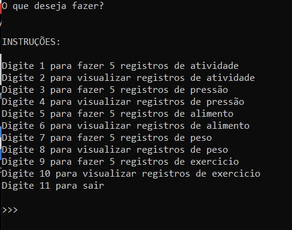

# Health Track Java :coffee: Oracle :o2:

#### início

Pessoal seguindo os projetos passados do Health Track, foi elaborado as primeiras estruturas do backend. Esta aplicação java tem como objetivo registrar e listar objetos conectados a um banco de dados Oracle.

#### tech utilizada

* Java

#### índice

O README foi dividido nos seguintes tópicos:

* O que é o Health Track ?
* Como abrir o programa
* Navegação
* Considerações Finais

#### O que é o Health Track ?

O Health Track é uma aplicação que registra e monitora a pesagem dos usuários. Primeiramente o usuário precisa fazer um cadastro para entrar no sistema. Após efetuar o login ele pode visualizar seus dados de cadastro; registrar, visualizar e editar sua lista de pesos; e consultar um dashboard dos dados  junto com o cálculo do último IMC.

Elaborei um protótipo utilizando HTML e CSS para ilustrar como seria o Health Track em ação.

</img>

Veja o <a href="https://github.com/Amorim-cyber/HealthTrack">Repositório</a> deste protótipo para maiores informações

#### Como abrir o programa

Siga os seguintes passos:

1. Baixe o arquivo neste repositório

   </img>

2. Extraia o arquivo e salve em um diretório de sua escolha 

   </img>

3. Clique no arquivo descompactado (nesse exemplo coloquei na pasta downloads) e em seguida clique na aplicação "HealthTrackOracle"

   </img>

##### PRONTO

A aplicação está pronta para uso.

</img>

### Navegação

Segue guia de uso do sistema

* TELA PRINCIPAL

  Unica tela do sistema, concentra todos os comandos. Segue abaixo uma breve explicação de cada item.

  </img> 

<ol>
        <li>O <b>Primeiro item</b> registra 5 tipos de atividade ao banco </li>
        <li>O <b>Segundo item</b> permite visualizar todas as atividades registradas</li>
        <li>O <b>Terceiro item</b> registra 5 tipos de pressão arterial ao banco </li>
        <li>O <b>Quarto item</b> permite visualizar todas as pressões arteriais registradas</li>
    	<li>O <b>Quinto item</b> registra 5 tipos de alimento ao banco</li>
        <li>O <b>Sexto item</b> permite visualizar todos os alimentos registrados </li>
    	<li>O <b>Setimo item</b> registra 5 tipos de peso ao banco</li>
        <li>O <b>Oitavo item</b> permite visualizar todos os pesos registrados </li>
    	<li>O <b>Nono item</b> registra 5 tipos de exercicio ao banco</li>
        <li>O <b>Décimo item</b> permite visualizar todos os exercicios registrados </li>
        <li>O <b>Décimo primeiro item</b> finaliza o programa</li>
</ol>

#### Considerações finais

O programa irá rodar em qualquer maquina que tenha o Java JDK instalado.

O projeto realiza uma preparação as estrutura de backend que o HealthTrack irá suportar.

### FORTE ABRAÇO ! :smile:

